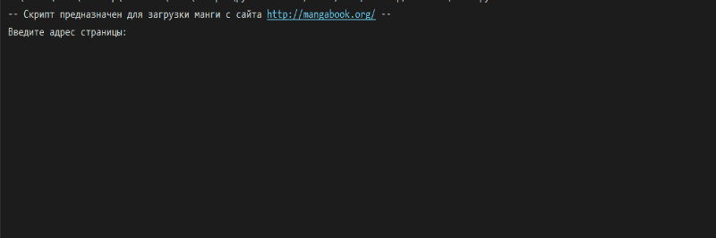

---

# Manga Download Script


 
 


---

#### *Manga Download Script* - простой скрипт, предназначеный для удобства скачивания манги с сайта https://mangabook.org

---

## Installing

+ Скачиваете файлы скрипта и зависимостей.
+ Устанавливаете виртуальное окружение.
+ Пользуетесь!

```python
py -m venv venv
venv\Scripts\activate
pip install -r requirements.txt
```
Скрипт написан под Win64, на остальных системах возможны ошибки из-за особенностей ОС, связанные с именами файлов и папок.

## Demo

Демонстрация работы скрипта



## Configuration

У скрипта есть несколько вариаций работы:
+ *Выберите способ загрузки файлов - по томам(V) или все(A):* 
  - *По томам* - при загрузке, в папке с названием книги будут созданы папки с названиями томов, в которых будут лежать главы.
  - *Все* - все загруженные главы будут лежать в папке с названием книги.
+ *Выберите расширение файлов - \*.zip(Z) или \*.cbz(C):*
  - Тут всё просто - выбор расширения итоговых файлов.
+ *Перепаковать файлы по томам? Да(Y)/Нет(N):*
  - *Да* - после загрузки, главы будут распакованы и склеены в один файл с названием тома (для ленивых, чтобы не открывать каждую главу).
  - *Нет* - действие описанное выше не будет произведено.
  
## Developing
### Built With

Для наглядной работы скрипта была использована библиотека [tqdm](https://tqdm.github.io)

## Licensing

Лицензия находится в файле LICENSE.
